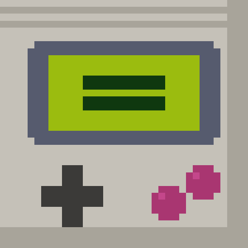

<p align="center">
  
</p>

<h1 align="center">CALC BOY</h1>

<p align="center">
  🇩🇪 <a href="README.de.md">Deutsche Version</a>
</p>

A calculator in classic Nintendo style – built as a Progressive Web App in a single HTML file (plus a small service worker). No installation, no app store, no external connections, no tracking.

## ▶️ Launch

**[➤ Open CALC BOY now](https://schrotty74.github.io/CalcBoy/)**

## 📱 Install on iPhone

1. Open the link above in **Safari**
2. Tap the **Share icon** → **"Add to Home Screen"**
3. CALC BOY now launches as a full-screen app

## ✨ Features (v3.0)

- 6 console themes: Game Boy, GB Color, NES, Super NES, Switch, Famicom (THEME button) – your choice is remembered
- 🕹️ **MATH ATTACK**: mental math against the clock (GAME menu) with 3 difficulty levels, per-level high scores and a PERFECT jingle for flawless runs
- 🔄 **Unit converter** (CONV page): km↔mi, °C↔°F, kg↔lb, cm↔in, l↔gal, km/h↔mph, h↔min, German VAT (19%/7% net↔gross)
- 📋 **Copy & share**: long-press the display to copy the result; export the history via the share sheet
- 🎵 Each console theme has its own key sound; theme switching plays a cartridge-swap animation
- 🔋 Battery LED shows the real charge level where the browser supports it (Chrome/Android; iOS keeps the classic red LED)
- ➕ **Extended mode** (EXT button): memory (MC/MR/M+/M−), sin/cos/tan with DEG/RAD switch, log, ln, 10^x, e^x, x², x³, xʸ, ∛, 1/x, factorial, π, e
- 💰 **Finance page** (FIN): compound-interest calculator with monthly savings rate, tip & bill splitting, currency conversion with a manually set rate (deliberately no live-rate API – nothing leaves the device)
- 💻 **Programmer page** (PRG): HEX/BIN/OCT display, AND, OR, XOR, NOT, MOD, bit shifts, ABS, INT, SGN, random number
- 📈 **Plot page**: draws sin, cos, tan, x², x³, √x, log x and 1/x as pixel graphs on the LCD
- 🐍 **SNAKE**: second game via the GAME menu, steered with 2/4/6/8 (or arrow keys), own high score
- Smart percent key: `100 + 10 %` gives 110, like a real calculator
- History shows sum (Σ) and average (Ø) of the last results
- 🔬 **Scientific mode**: rotate to landscape for a quick-access function column
- 📜 **History**: tap the display to see your last 10 calculations, tap an entry to reuse its result
- Basic arithmetic, percent, sign toggle, square root
- Boot animation and 8-bit sounds, mutable (SND button)
- German number format (decimal comma, thousands separators)
- Works offline via service worker; all data stays on your device
- 🥚 Legend has it an old code unlocks a seventh console …

## 📖 Manual

The full manual is in [MANUAL.md](MANUAL.md) (🇩🇪 [deutsch](MANUAL.de.md)).

## 🤖 Ask an AI about CALC BOY

One tap opens an AI chat that reads the manual first and then answers your questions:

- [**Ask ChatGPT**](https://chatgpt.com/?q=Please%20read%20the%20CALC%20BOY%20manual%20at%20https%3A%2F%2Fschrotty74.github.io%2FCalcBoy%2FMANUAL.md%20%28fallback%20if%20that%20fails%3A%20https%3A%2F%2Fraw.githubusercontent.com%2FSchrotty74%2FCalcBoy%2Fmain%2FMANUAL.md%29%20and%20then%20answer%20my%20questions%20about%20this%20calculator%20app%20and%20its%20functions.)
- [**Ask Claude**](https://claude.ai/new?q=Please%20read%20the%20CALC%20BOY%20manual%20at%20https%3A%2F%2Fschrotty74.github.io%2FCalcBoy%2FMANUAL.md%20%28fallback%20if%20that%20fails%3A%20https%3A%2F%2Fraw.githubusercontent.com%2FSchrotty74%2FCalcBoy%2Fmain%2FMANUAL.md%29%20and%20then%20answer%20my%20questions%20about%20this%20calculator%20app%20and%20its%20functions.)
- **Ask Gemini**: [open Gemini](https://gemini.google.com/app) and paste this prompt (Gemini doesn't support prefilled links):

```
Please read the CALC BOY manual at https://schrotty74.github.io/CalcBoy/MANUAL.md (fallback if that fails: https://raw.githubusercontent.com/Schrotty74/CalcBoy/main/MANUAL.md) and then answer my questions about this calculator app and its functions.
```

## ⌨️ Keyboard (Mac/iPad)

Digits, `+ - * /`, `Enter` = result, `Esc` = AC, `%`, `R` or `W` = square root

## 🔒 Privacy

No external requests, no tracking, no analytics. Settings, history and high score are stored locally in your browser only. Details in [SECURITY.md](SECURITY.md).

## 📄 License

[GPL-3.0](LICENSE) – Font "Press Start 2P" by CodeMan38, licensed under the SIL Open Font License 1.1.
