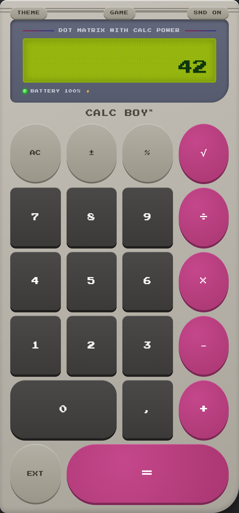
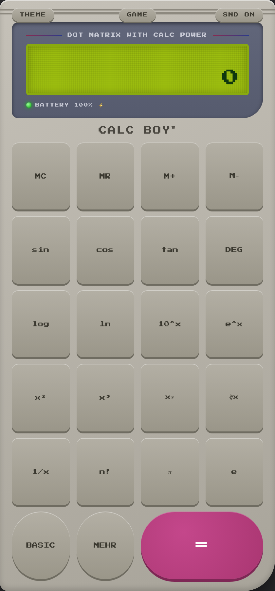
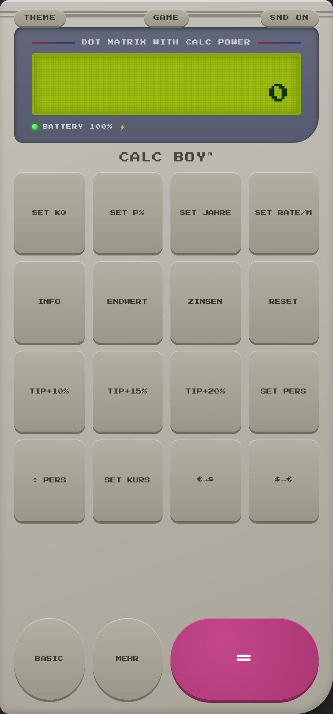
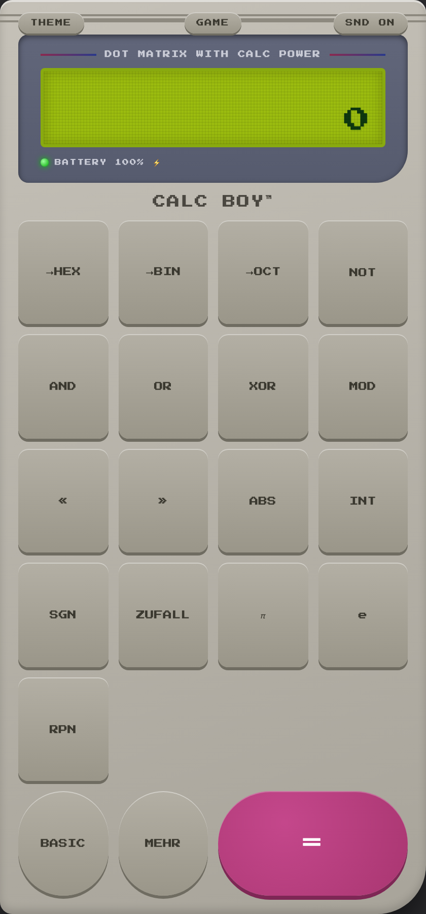
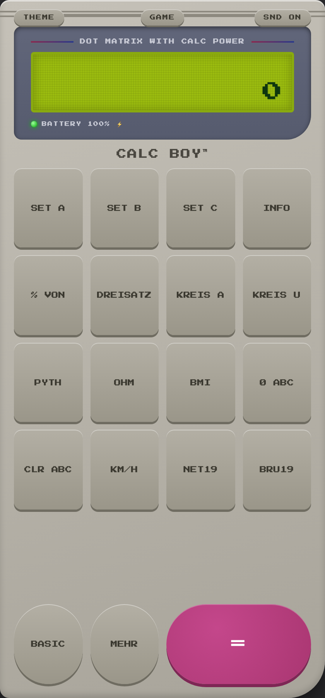

# CALC BOY - Quick Start Guide

Version: 3.1.0

CALC BOY is a local-first PWA calculator styled after classic handheld consoles. This documentation describes the current source code for version 3.1.0.

## Installation

1. Open the live link in Safari or Chrome.
2. Use Share or the browser menu and choose Add to Home Screen.
3. Launch CALC BOY from the home screen. Installed mode opens the app fullscreen.

## Offline Mode

The service worker caches the app shell, index.html and icons under calcboy-v3.1.0. Registration runs only on HTTPS. After the first online launch, the app can start from cache.

## Interface overview

Use EXT to leave BASIC, MEHR to cycle through the extra pages, and BASIC to return.

### BASIC

Standard calculator for everyday arithmetic, signs, square roots and smart percent calculations.

**How to use it**

- Enter the first number, choose an operator, enter the second number, then press =.
- Use AC to clear the current calculation. After ERROR, the next digit starts a new entry.
- Tap the LCD to open history; long-press the LCD to copy the displayed result.

**Important details**

- The percent key is context-aware: with + or - it calculates a percentage of the first operand.

**Examples**

- **Smart percent:** 100 + 10 % = 110; 100 - 10 % = 90
- **Square root:** 144 sqrt -> 12

### EXT

Scientific and memory page with trigonometry, logarithms, powers, roots, factorial, pi and e.

**How to use it**

- For direct functions such as sin, log, x^2 or 1/x, enter a value and press the function key.
- For x^y, enter the base, press x^y, enter the exponent, then press =.
- Use DEG/RAD before trigonometry. DEG is saved and is the default unless changed.

**Important details**

- Factorial works only for whole numbers from 0 to 170.

**Examples**

- **DEG/RAD:** DEG: 30 sin -> 0.5; RAD: pi sin -> approximately 0
- **Memory:** 42 M+, AC, MR -> 42; 10 M- leaves 32 in memory
- **Powers:** 2 x^y 8 = -> 256

### CONV

One-tap converters for distance, temperature, mass, volume, speed, time and German VAT.

**How to use it**

- Enter the source value and press the desired conversion key.
- Use the matching reverse key if you need to convert back.
- VAT keys treat the entered value as net or gross according to the key label.

**Important details**

- US gallons are used for litre/gallon conversion.

**Examples**

- **VAT:** 100 MW+19 -> 119; 119 MW-19 -> 100
- **Temperature:** 20 C->F -> 68; 68 F->C -> 20
- **Speed:** 100 km/h->mph -> 62.137119224

### FIN

Finance helpers for compound interest with monthly savings, interest amount, tips, bill splitting and manual currency conversion.

**How to use it**

- Set K0, P%, years and monthly rate with SET keys. ENDWERT calculates the future value.
- ZINSEN shows only the earned interest: future value minus start capital and deposits.
- Set persons before / PERS. Set exchange rate before EUR->$ or $->EUR.

**Important details**

- Default values are K0 1000, P 3, years 10, monthly rate 50, persons 2 and exchange rate 1.08.

**Examples**

- **Compound interest:** SET K0=1000, SET P%=3, SET JAHRE=10, SET RATE/M=50, ENDWERT -> 8336.42449101
- **Interest only:** With the same values, ZINSEN -> 1336.42449101
- **Bill split:** SET PERS=4, enter 80, / PERS -> 20
- **Currency:** SET KURS=1.08, 100 EUR->$ -> 108; 108 $->EUR -> 100

### PRG

Programmer functions, integer base display, bitwise operators, random number and RPN mode.

**How to use it**

- HEX, BIN and OCT show the integer part of the display in the status line.
- AND, OR, XOR, MOD, << and >> are binary operators: enter first value, operator, second value, =.
- RPN changes = into push: enter a value, press =, enter the next value, then press an operator.

**Important details**

- Bitwise functions use JavaScript integer behaviour and truncate decimal parts.

**Examples**

- **Base display:** 255 ->HEX shows FF; ->BIN shows 11111111
- **Binary operations:** 5 AND 3 = 1; 5 OR 2 = 7; 9 MOD 4 = 1
- **RPN:** RPN on: 12 =, 3 + -> 15; AC clears the stack

### PLOT

Draws 20 built-in function graphs as pixel plots on the LCD.

**How to use it**

- Open PLOT and press a function key such as sin x, x^2 or GAUSS.
- The graph replaces the LCD temporarily and scales itself automatically.
- Press any other key or tap the display to close the graph.

**Important details**

- Asymptotes such as tan x or 1/x are clipped so the plot stays readable.

**Examples**

- **Graph:** sin x draws y = sin x; any non-plot key closes it
- **Compare:** x^2 and x^3 use different automatic scales

### FORM

Formula assistant based on three stored variables A, B and C.

**How to use it**

- Enter a number and press SET A, SET B or SET C to store it.
- Press INFO to check stored values. CLR ABC resets all variables to 0.
- Press a formula key; the result appears on the display and is added to history.

**Important details**

- Formula keys use fixed roles: for example BMI uses A as kg and B as metres; speed uses A as kilometres and B as hours.

**Examples**

- **Percent:** SET A=20, SET B=150, % VON -> 30
- **Pythagoras:** SET A=3, SET B=4, PYTH -> 5
- **BMI:** SET A=80, SET B=1.8, BMI -> 24.6913580247
- **Net/gross:** SET A=119, NET19 -> 100; SET A=100, BRU19 -> 119

## Games

GAME opens the menu. Press 1, 2 or 3 for Math Attack levels, or 5 for Snake.

## Keyboard

- `0-9` - digits
- `, or .` - decimal separator
- `+ - * /` - basic operators
- `Enter or =` - equals
- `Escape` - AC
- `%` - percent
- `r or w` - square root
- `arrow keys` - Snake direction and secret-code input

## Storage and Privacy

All data remains in browser localStorage. There is no analytics code, no external font request and no live exchange-rate API.

theme, sound, angle mode, history, memory, finance parameters, exchange rate, persons, RPN mode, RPN stack, formula variables, game high scores, Virtual Boy unlock

## Limitations

Service worker registration only runs on HTTPS. The inline manifest has icons only when opened via HTTP or HTTPS. Currency conversion uses a manually stored rate and no live-rate API. Programmer base conversion displays the converted value in the status line; it does not replace the main display. Browser sharing, clipboard, vibration and battery display depend on browser support. The UI language inside the app is German.

## Version Information

CALC BOY 3.1.0 / calcboy-v3.1.0
