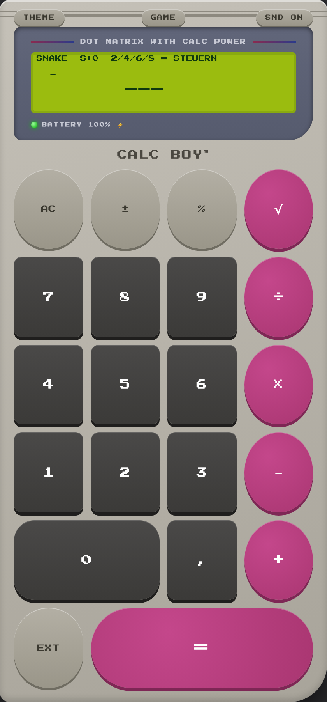

# CALC BOY - User Manual

Version: 3.1.0

CALC BOY is a local-first PWA calculator styled after classic handheld consoles. This documentation describes the current source code for version 3.1.0.

## Installation

1. Open the live link in Safari or Chrome.
2. Use Share or the browser menu and choose Add to Home Screen.
3. Launch CALC BOY from the home screen. Installed mode opens the app fullscreen.

## Offline Mode

The service worker caches the app shell, index.html and icons under calcboy-v3.1.0. Registration runs only on HTTPS. After the first online launch, the app can start from cache.

## BASIC

Buttons: AC, +/-, %, sqrt, 7, 8, 9, /, 4, 5, 6, *, 1, 2, 3, -, 0, ,, +, EXT, =

## EXT

Buttons: MC, MR, M+, M-, sin, cos, tan, DEG/RAD, log, ln, 10^x, e^x, x^2, x^3, x^y, cbrt, 1/x, n!, pi, e, BASIC, MEHR, =

## CONV

Buttons: km->mi, mi->km, m->ft, ft->m, C->F, F->C, kg->lb, lb->kg, cm->in, in->cm, l->gal, gal->l, km/h->mph, mph->km/h, h->min, min->h, MW+19, MW-19, MW+7, MW-7, BASIC, MEHR, =

## FIN

Buttons: SET K0, SET P%, SET JAHRE, SET RATE/M, INFO, ENDWERT, ZINSEN, RESET, TIP+10%, TIP+15%, TIP+20%, SET PERS, / PERS, SET KURS, EUR->$, $->EUR, BASIC, MEHR, =

## PRG

Buttons: ->HEX, ->BIN, ->OCT, NOT, AND, OR, XOR, MOD, <<, >>, ABS, INT, SGN, ZUFALL, pi, e, RPN, BASIC, MEHR, =

## PLOT

Buttons: sin x, cos x, tan x, x^2, x^3, sqrt x, log x, 1/x, e^x, ln x, |x|, 2^x, sinh, cosh, tanh, x^4, GAUSS, FLOOR, sinc x, x*sin x, BASIC, MEHR, =

## FORM

Buttons: SET A, SET B, SET C, INFO, % VON, DREISATZ, KREIS A, KREIS U, PYTH, OHM, BMI, AVG ABC, CLR ABC, KM/H, NET19, BRU19, BASIC, MEHR, =

## Games

- `0-9` - digits
- `, or .` - decimal separator
- `+ - * /` - basic operators
- `Enter or =` - equals
- `Escape` - AC
- `%` - percent
- `r or w` - square root
- `arrow keys` - Snake direction and secret-code input

## Storage and Privacy

All data remains in browser localStorage. There is no analytics code, no external font request and no live exchange-rate API.

theme, sound, angle mode, history, memory, finance parameters, exchange rate, persons, RPN mode, RPN stack, formula variables, game high scores, Virtual Boy unlock

## Limitations

- Service worker registration only runs on HTTPS.
- The inline manifest has icons only when opened via HTTP or HTTPS.
- Currency conversion uses a manually stored rate and no live-rate API.
- Programmer base conversion displays the converted value in the status line; it does not replace the main display.
- Browser sharing, clipboard, vibration and battery display depend on browser support.
- The UI language inside the app is German.

## Version Information

CALC BOY 3.1.0 / calcboy-v3.1.0
